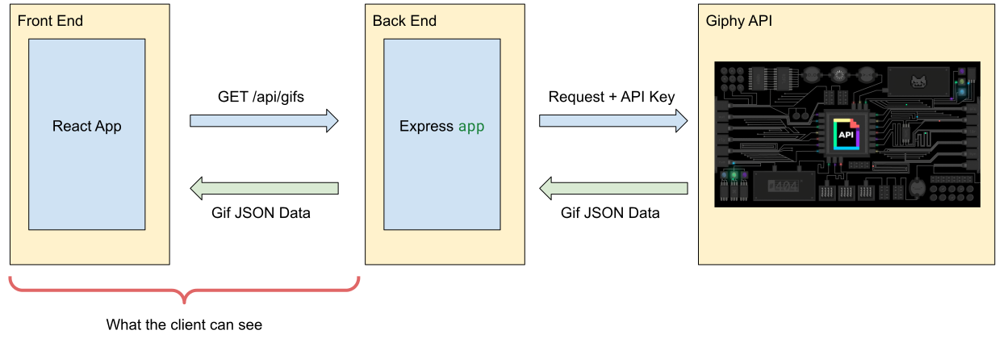
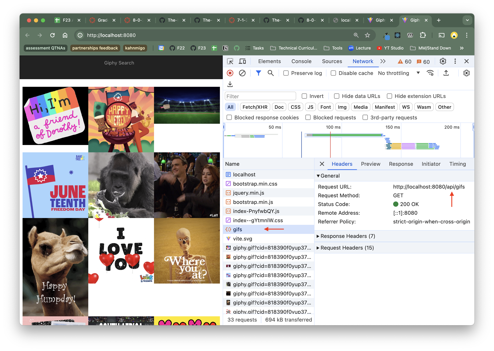

# Securing API Keys

Deployment Link: 

In this assignment, you will be given a working Giphy Search React application (remember that assignment?). Then, you'll use Express as a middleman for API requests, allowing us to deploy the project while keeping the API key secure. 

Refer to the associated [lecture notes](https://marcylabschool.gitbook.io/marcy-lab-school-docs/mod-8-backend/3-securing-api-keys-with-environment-variables) for support.

**Table of Contents**
- [Setup](#setup)
  - [Starter Code](#starter-code)
- [Grading](#grading)
- [Server Side](#server-side)
  - [Part 1 — Create an Endpoint and Controller](#part-1--create-an-endpoint-and-controller)
- [Part 2 — Create an Environment Variable for the API Key](#part-2--create-an-environment-variable-for-the-api-key)
- [Client Side](#client-side)
  - [Part 3 — Update the Frontend React application:](#part-3--update-the-frontend-react-application)
  - [Part 4 — Enable Proxy Requests during development](#part-4--enable-proxy-requests-during-development)
- [Deployment](#deployment)
  - [Part 5 — Deploy](#part-5--deploy)
- [Bonus Challenge!](#bonus-challenge)

## Setup

For guidance on setting up and submitting this assignment, refer to the Marcy lab School Docs How-To guide for [Working with Short Response and Coding Assignments](https://marcylabschool.gitbook.io/marcy-lab-school-docs/fullstack-curriculum/how-tos/working-with-assignments#how-to-work-on-assignments).

After cloning your repository, make sure to run the following commands:

```sh
git checkout -b draft
```

### Starter Code

In this repo, you are provided with two folders, `frontend/` and `server/`. Inside of `frontend/` is a pared-down version of the "Giphy Search" React application and inside of `server/` is the code for a static web server that serves this React application. 

Install dependencies and build this project by first running the following commands inside of the `frontend/` directory:

```sh
# make sure to cd into frontend/
npm i
npm run build
```

Then, install dependencies and start the server by running the following commands inside of the `server/` directory:

```sh
# make sure to cd into server/
npm i
npm start
```

As you can see, the frontend application tries to use the Giphy API to show trending gifs of the day, but it's not quite working as it is unauthorized (we get a 401 status code). 

Look into the code provided in `frontend` and see why:
- The `App` component renders the `GifContainer` 
- `GifContainer` uses the `getTrendingGifs` adapter function from `giphyAdapters.js` to fetch gifs.
- `getTrendingGifs` sends a fetch request but doesn't have a valid `API_KEY` value. This is why we get a 401!

Since this frontend code is sent by the server to every user, we can't just put in a valid `API_KEY` value here. Doing so would just be giving every user our secret API key! Instead, we need to set up our server to be able to perform this fetch request and then have our frontend request that data from the server. 

In the end, this is the flow of data that we are looking for:



As a result, only the server will know the API key and the frontend (which is ultimately what our users will see) only interacts with our own server.

## Grading

Your grade on this assignment will be determined by the number of tasks you are able to complete. Tasks appear as a checkbox, like this:

- [ ] example of an incomplete task
- [x] example of an completed task

Feel free to mark these tasks as complete/incomplete, however your instructor will likely modify your tasks when grading.

This assignment has 11 requirements and 1 bonus requirement:
- 4 environment variable requirements
- 4 server-side requirements
- 2 client-side requirements
- 1 deployment task

**Environment Variable Requirements**

Before submitting, make sure that these tasks are completed!

- [ ] Environment variables are stored in the `.env` folder
- [ ] `.env` and `node_modules` are added to a `.gitignore` file
- [ ] `dotenv` is installed as a dependency
- [ ] `process.env` is used to access the environment variable

**Server-Side Technical Requirements**

- [ ] A `GET /api/gifs` endpoint exists with a controller. 
- [ ] The controller for the `/api/gifs` endpoint sends a request to the Giphy API using the API key.
- [ ] If an error occurs when fetching, a `503` status is sent to the client along with the `error` object.
- [ ] If the Giphy API fetch is successful, the fetched data is sent to the client.

**Client-Side Technical Requirements**
- [ ] The frontend sends a request to `/api/gifs` instead of directly to the Giphy API
- [ ] The frontend `vite.config.js` file has been updated to enable proxy requests
- [ ] Bonus: The `/api/gifs` endpoint can parse the `req.query` parameters to get the search term and make a request to the Giphy API's search endpoint.

**Deployment Technical Requirements**

- [ ] Your server is deployed and the link is added to this repo's README

You got this!

## Server Side
### Part 1 — Create an Endpoint and Controller 

Before you begin, you'll need to log into your [Giphy Developer Dashboard](https://developers.giphy.com/dashboard/) and copy your API Key.

The provided server application can currently serve static assets in the `frontend/dist` folder. Your first task is to add a `GET /api/gifs` endpoint and controller that can send a request to the trending endpoint of the Giphy API and respond with the fetched data.

Use the Giphy API endpoint below:

```
https://api.giphy.com/v1/gifs/trending?limit=3&rating=g&api_key=API_KEY
```

When the server receives a `GET /api/gifs` request, it should:
- Send the fetched data OR
- Send an `error` object and a 503 status code if an error occurred

> Tip: A `handleFetch` helper function has been provided for you if you want practice using it!

Test this out by sending a GET request to `http://localhost:8080/api/gifs` in your browser. You should see the fetched gifs with no authorization errors!

## Part 2 — Create an Environment Variable for the API Key

To safely store and use your API key, it should be stored as an environment variable in a `.env` file. We'll then use the `dotenv` module to access it. Do the following:

1. In the `server` folder, create a `.env` file and store your Giphy API key inside as an environment variable
2. Then, create a `.gitignore` file with `.env` listed
3. Next, install the `dotenv` module as a dependency of the server:
4. Make sure that your server uses `process.env` to access your API key and does not include the API key anywhere in the source code.

Once you've completed these steps, go ahead and add, commit, and push your code. Since you've listed the `.env` file in your `.gitignore` file, it should be hidden from the public repository. Confirm that you CANNOT see the `.env` file in your repository and that your API key is not listed in any of your source code before moving on.

> When it comes time to deploy this project, you will be able to provide the server hosting service with environment variables that will be securely stored and hidden from the public but that your server will have access to.

## Client Side
### Part 3 — Update the Frontend React application:

Now that your server has an `/api/gifs` endpoint, our frontend no longer needs to directly interact with the Giphy API. Instead, it can just use the `/api/gifs` endpoint and let the server send the request to Giphy.

Remember, this is what we're looking for:


Do the following: 
* Rewrite the `getTrendingGifs` function in the `giphyAdapters.js` file such that it sends requests to the `/api/gifs` endpoint of the server instead of directly to the Giphy API.
* Keep your server running and open a separate terminal. Navigate to the `frontend` folder and run `npm run build` to update the `dist/` folder
* If your server was still running, you should now see the trending gifs being fetched!
* Open the Developer Tools Network Tab and refresh the page
* You should see a request sent to `gifs` and there should NOT be a request sent to the Giphy API (see below)
  * If this is not the case, double check that you have re-built your frontend and updated the `dist/` folder.



### Part 4 — Enable Proxy Requests during development

Keep the server running and in your second terminal with the `frontend` directory open, run `npm run dev`. As you recall, this starts a development server which will serve the frontend and update each time it is modified. This development server is much more convenient compared to having to run `npm run build` and then use our own server to view the changes.

Open the Vite development server at [http://localhost:5173/](http://localhost:5173/) and you'll notice that the gifs aren't being fetched! 

Upon inspection of the network requests, you'll see that the request to the `/api/gifs` endpoint is going to `http://localhost:5173/api/gifs`. However, our server is running at `http://localhost:8080`!

This occurs because the fetch url doesn't specify a host and so our application assumes it is the current server origin. When we switch to serving the application using the Vite development server on port 5713, this fetch url changes as well. 

To fix this, update the `frontend/vite.config.js` file to enable **proxy requests** during development.

```js
import { defineConfig } from 'vite';
import react from '@vitejs/plugin-react';

const SERVER_PORT = 8080;

// https://vitejs.dev/config/
export default defineConfig({
  plugins: [react()],
  server: {
    proxy: {
      '/api': {
        target: `http://localhost:${SERVER_PORT}`,
        changeOrigin: true,
      },
    },
  },
});
```

Doing so tricks our Vite development server into sending requests that start with `/api` to `http://localhost:8080` instead of `http://localhost:5173`.

## Deployment

### Part 5 — Deploy

When you're done, push your code to github and [follow these steps to deploy using Render](https://marcylabschool.gitbook.io/marcy-lab-school-docs/how-tos/deploying-using-render). Make sure to add environment variables for your API key! 

Then, add the deployed link to the top of this README.

## Bonus Challenge!
Add a search endpoint to your server, letting the frontend send search GET requests to the backend using query parameters.
* When the user submits the search form with the term `"fox"`, the frontend should send a request to `/api/gifs?search=fox`.
* When the server receives this request, it should look at the `req.query` object to find the `search` value and then make a request to the Giphy API's search endpoint.